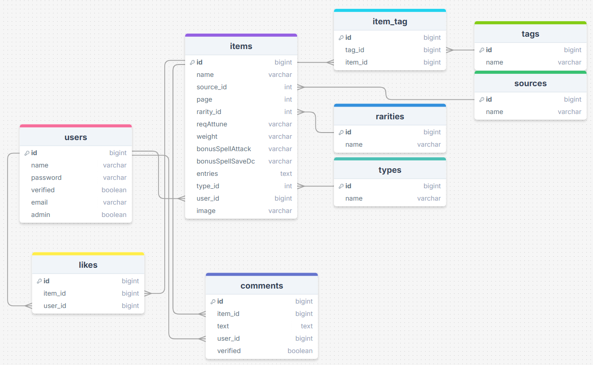

# Changelog

### 30-10-2024
- logo en naam gemaakt voor website: Arcane Archive
- image input verbeterd voor item create
- item create bij admin veranderd in tag create zodat admin dezelfde item create gebruikt als user, maar dan met een paar extra opties
- edit pagina toegevoegd
- styling verbeterd van create en edit
- fancy image veld functionaliteit werkend gekregen

### 29-10-2024
- validatie opnieuw toegevoegd bij het maken van een item
- tags tabel en koppeltabel toegevoegd
- dropdown checkbox voor rarities ingevuld
- flowbite geïnstalleerd
- dropdown checkbox voor sources en types ingevuld
- dropdown search functie werkend gekregen voor zoeken op specifieke types, rarities en sources
- sorteerfunctie toegevoegd naast searchbar

### 26-10-2024
- create item aangemaakt voor admin (omdat die meer kan toevoegen dan alleen homebrew)
- kleuren verbeterd van de rarities
- sort by menu toegevoegd (alleen het menu, geen functionalitiet nog)
- dropdown checkbox menu toegevoegd om later te gebruiken voor de tags, sources, rarities en types

### 25-10-2024
- de gezochte tekst in de zoekbalk laten staan door het mee te geven via de controller
- een admin dashboard aangemaakt en een normale user dashboard toegevoegd
- een route gemaakt die naar dit dashboard lijdt ipv de standaard dashboard van laravel
- een auth checker toegevoegd in de route en de controller voor extra beveiliging
- seeder gemaakt voor items

### 23-10-2024
- search balk toegevoegd
- filter toegevoegd voor de search balk zodat je dingen kan opzoeken uit de naam en entries
- admin en verified toegevoegd aan users tabel via een migration
- seeders gemaakt voor rarities, types en sources

### 22-10-2024
- images toegevoegd via public folder en opgeslagen in database met path
- in create een input toegevoegd voor images
- images van types gebruikt op index als het image veld in items op null staat
- validation weggehaald uit itemcontroller omdat het niet wilde werken als je geen image selecteerde
- styling verbeterd

### 21-10-2024
- kleuren toegevoegd aan rarities migration en images toegevoegd aan types migration
- images toegevoegd aan items via een nieuwe migration
- app layout toegepast op index en create
- @auth gebruikt voor de create button zodat alleen ingelogde gebruikers een item kunnen maken
- validation toegevoegd aan itemcontroller voor items maken
- index verbeterd met plaatjes, kleuren en cards

### 16-10-2024
- rarities, types en sources tabellen aangemaakt via migrations (met alleen naam en id er in)
- deze tabellen gekoppeld aan items via een foreign key
- data voor deze tabellen ingevuld
- create pagina verbeterd met meer keuzes

### 15-10-2024
- items tabel aangemaakt met migration
- items uit tabel op index laten zien via naam en entries
- details pagina aangemaakt die de volledige info laat zien (zonder styling)
- create pagina gemaakt voor naam en entries

### 14-10-2024
- homepage aangemaakt
- itemcontroller aangemaakt met een view voor de index

### 10-10-2024
- User stories gemaakt
- ERD gemaakt

### 9-10-2024
- Startproject gemaakt met Laravel
- Breeze geïnstalleerd

--- 
## **ERD**

---
## **User Stories**

### Gebruiker:
- Moet alle geverifieerde items kunnen zien - M
- Moet kunnen zoeken om een specifiek item te kunnen vinden - M
- Moet tags kunnen gebruiken om een specifiek item te kunnen vinden - M
- Moet kunnen registreren - M
- Moet kunnen inloggen - M
- Moet meer informatie over het item kunnen zien door eropte klikken - M
- Moet kunnen zien wat geregistreerde gebruikers erover hebben gecomment - S
- Moet alle items kunnen sorteren om beter items te kunnen vinden - S

### Geregistreerde gebruiker:
- Moet zelf een homebrew item kunnen toevoegen nadat de gebruiker 5 andere items heeft geliket - M
- Moet eigen items kunnen zien - M
- Moet eigen items kunnen editen - M
- Moet eigen items kunnen verwijderen - M
- Moet een item kunnen liken - M
- Moet gelikete items later terug kunnen vinden - M
- Moet comments achter kunnen laten op items - S
- Moet eigen comments kunnen zien, bewerken en verwijderen - S

### Admin
- Moet items kunnen verifiëren - M
- Moet items kunnen verwijderen - M
- Moet items kunnen maken met meer details (niet alleen homebrew) - M
- Moet andere data toe kunnen voegen zoals de rarities, de types en de sources - S
- Moet comments achter kunnen laten (waar admin achter staat) - S
- Moet comments kunnen verwijderen - S
- Moet gebruikers kunnen verwijderen - S
